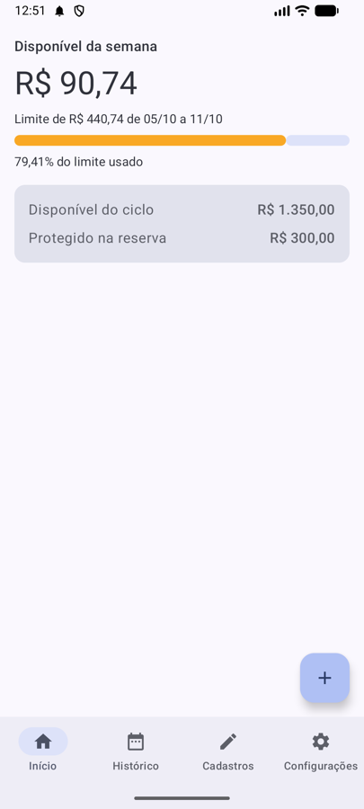
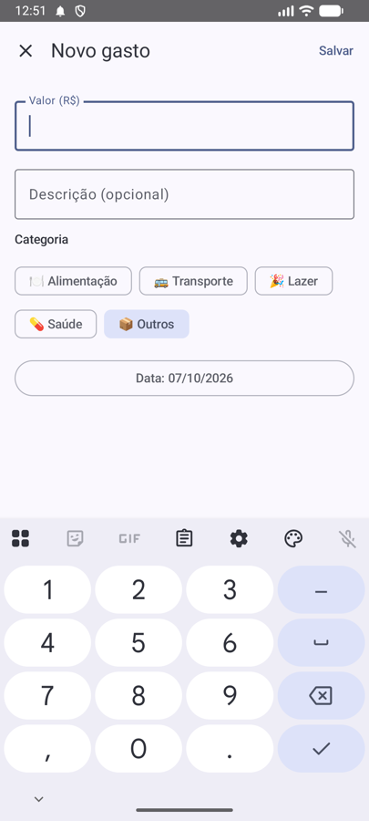
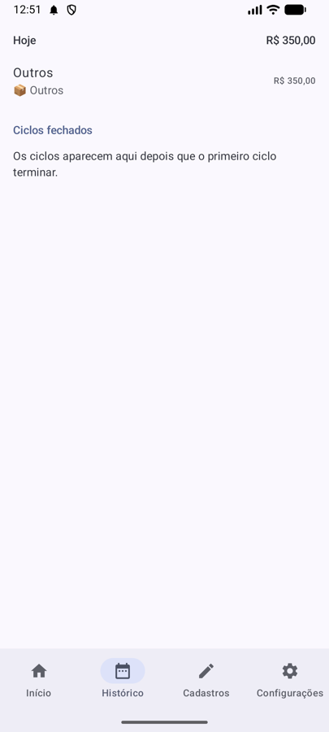
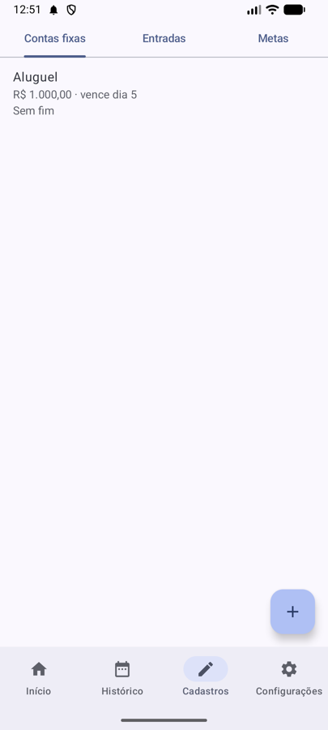
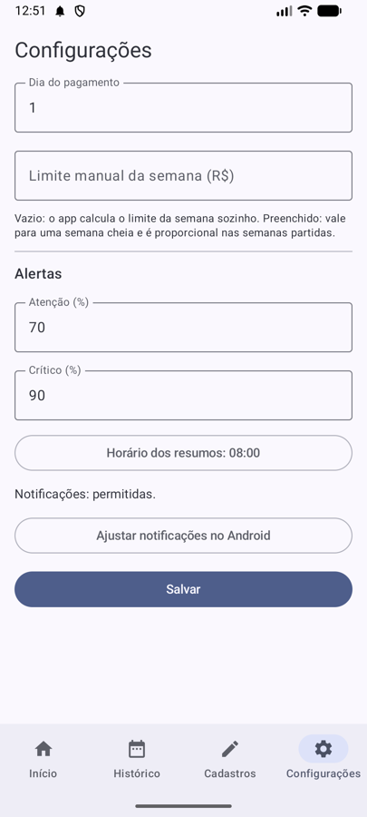
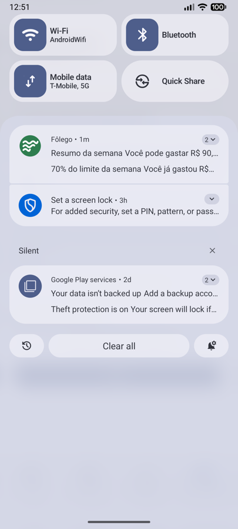
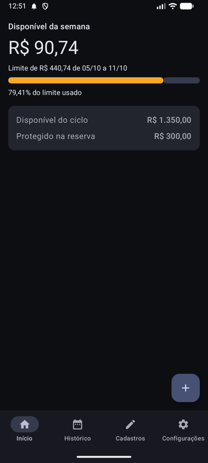

# Fôlego


App de finanças pessoais para Android, offline, que responde toda semana: **quanto posso gastar sem
comprometer as contas fixas e a reserva?**

Repositório: https://github.com/Jota0404/financas-app

| Início | Novo gasto | Histórico | Cadastros |
| --- | --- | --- | --- |
|  |  |  |  |

| Configurações | Avisos | Modo escuro |
| --- | --- | --- |
|  |  |  |

## O que o app faz

- **Ciclo do salário:** o mês financeiro vai de um pagamento até a véspera do próximo, no dia que
  você escolher.
- **Reserva antes de tudo:** metas em reais ou em percentual das entradas saem antes de qualquer
  gasto e nunca aparecem como disponível.
- **Limite da semana:** o que sobra do ciclo é dividido pelos dias que faltam, e a tela inicial
  mostra quanto ainda dá para gastar na semana, com uma barra verde, amarela ou vermelha.
- **Gasto em 2 toques:** "+" e "Salvar"; o teclado numérico já abre no valor.
- **Contas fixas com parcelas** ("parcela 3 de 10"), entradas recorrentes e avulsas, e histórico do
  ciclo por dia.
- **Avisos:** resumo da semana, 70% e 90% do limite, reserva invadida e fechamento do ciclo, cada
  um no máximo uma vez por período.
- **Retrato de cada ciclo:** ao fechar, os totais ficam guardados; editar uma conta depois não muda
  o passado.
- Funciona sem internet, e os dados entram no backup do Android.

## Stack

- **Kotlin** e **Jetpack Compose** (Material 3), MVVM em camadas
- **Domínio em Kotlin puro** (módulo `:domain`): todas as regras de cálculo, sem Android, testadas
  sem aparelho
- **Room** (banco), **DataStore** (configurações), **WorkManager** (rotina diária dos avisos)
- **Hilt** (injeção de dependência), **Coroutines + Flow** (telas que se atualizam sozinhas)
- **Testes:** JUnit, Turbine, Robolectric e Compose UI Test; GitHub Actions a cada push

A especificação completa está em [`docs/briefing.md`](docs/briefing.md), e o andamento, em
[`docs/andamento.md`](docs/andamento.md).

## Como rodar e testar

Abra o projeto no Android Studio e use o botão ▶ Run com o emulador ou o celular conectado. Pelo
terminal, com o Java do Android Studio:

```bash
export JAVA_HOME="/Applications/Android Studio.app/Contents/jbr/Contents/Home"
./gradlew test assembleDebug lintDebug        # testes no computador, APK de teste e lint
ANDROID_SERIAL=emulator-5554 ./gradlew connectedDebugAndroidTest   # testes no aparelho: só no emulador
```

## APK final (release)

O APK final é assinado com uma chave que fica **fora do Git**: o arquivo `keystore.properties`, na
raiz do projeto, aponta para a chave e guarda a senha, e o Git ignora os dois. Com ele no lugar:

```bash
./gradlew assembleRelease    # gera app/build/outputs/apk/release/app-release.apk
```

Sem o `keystore.properties` (como no GitHub Actions), o release sai sem assinatura. Guarde uma cópia
da chave e da senha num lugar seguro: sem elas, não dá para atualizar o app instalado.

## Estrutura de pastas

```text
financas-app/
├── docs/
│   ├── prints/                imagens do README
│   ├── briefing.md            especificação oficial do app (regras RN, critérios CA)
│   ├── andamento.md           em que etapa o projeto está e o que já foi feito
│   └── qa/                    relatórios de revisão do QA, um por entrega
├── .claude/                   configuração do assistente de desenvolvimento (Claude Code)
│   ├── agents/                agentes coder (desenvolvedor) e qa (revisor)
│   └── skills/                /verificar, /testar-emulador e /cobertura-rn-ca
├── app/src/main/java/com/joaobarcelos/financas/   módulo :app (Android)
│   ├── ui/                    telas e ViewModels, uma pasta por funcionalidade (FolegoApp.kt: abas)
│   │   ├── inicio/            tela inicial (disponível da semana e do ciclo)
│   │   ├── gastos/            registro de novo gasto
│   │   ├── cadastros/         contas fixas, entradas e metas de reserva
│   │   ├── historico/         gastos do ciclo e ciclos fechados
│   │   ├── configuracoes/     dia do pagamento, limites e alertas
│   │   ├── onboarding/        assistente de primeiro uso
│   │   └── theme/             cores, fontes e tema do app
│   ├── data/                  acesso a dados
│   │   ├── local/entity/      tabelas do Room
│   │   ├── local/dao/         consultas ao banco (DAOs)
│   │   ├── datastore/         configurações salvas
│   │   └── repository/        ponte entre o domínio e o banco/configurações
│   ├── worker/                rotina diária (WorkManager) e notificações dos alertas
│   └── di/                    módulos do Hilt
├── app/src/test/java/com/joaobarcelos/financas/
│   ├── data/                  testes do banco, dos repositórios e do DataStore (Robolectric, sem aparelho)
│   └── ui/                    testes de tela (Robolectric, sem aparelho)
├── app/schemas/               esquema do banco a cada versão, base para as migrações do Room
├── app/src/androidTest/java/com/joaobarcelos/financas/
│   ├── BackupTest.kt          teste no aparelho: backup automático ligado (RN16)
│   ├── RegistrarGastoTest.kt  teste no aparelho: registrar gasto em até 3 toques (CA12)
│   └── ArmazenamentoDeTeste.kt  banco em memória para os testes no aparelho (só no emulador)
├── domain/                    módulo :domain, regras de negócio em Kotlin puro (sem Android)
│   ├── src/main/kotlin/com/joaobarcelos/financas/domain/
│   │   ├── model/             modelos do domínio (Entrada, ContaFixa, Gasto...)
│   │   ├── usecase/           casos de uso (ações do app)
│   │   ├── repository/        interfaces dos repositórios (implementadas no :app, em data/)
│   │   ├── formato/           reais, percentuais e datas no formato brasileiro
│   │   └── calculadora/       cálculos de ciclo, reserva, disponível e limite semanal
│   └── src/test/kotlin/...    testes das regras (RN) e dos critérios de aceite (CA)
├── CLAUDE.md                  regras de trabalho para o assistente de desenvolvimento
└── README.md
```
